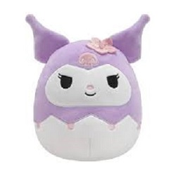

# CapstoneAssessment1
Year Up Week 2 - Capstone Assessment: Build an E-commerce Website
## Description
Sanrio-inspired online shop for all the Hello Kitty and Friends Fan with classic and limited edition plushies.
It's not completely responsive, just a demo for my assessment. It was built for educational purposes using prior knowledge on VS code.
Also used Bootstrap and w3schools for the first time as a resource. Through the process, I learned to use GitHub, explored Bootstrap, and familiarized myself with it for efficient use.

## site images

## note 
an interesting HTML I wrote was 
 

      

        <a href="ALL.html">   ALL</a>   

        <a href="Categories.html">  Hello Kitty</a>
        <a href="Categories.html">   Build-A-Bear</a> 
        <a href="Categories.html">   Keychain Dangler</a>
        <a href="Categories.html">   Squishmallow</a>
        

    
 
    because we learned this in class and how to use sm- md- lg- to fit different screens and I managed to make it into my product category links and included an image for each 

